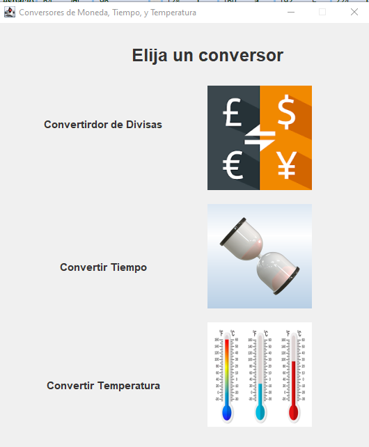
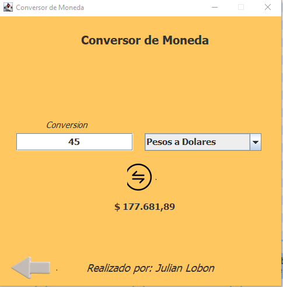
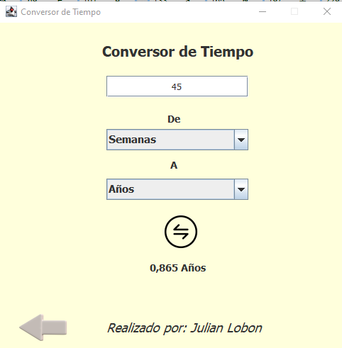
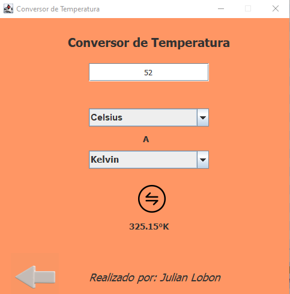

# 👨🏽‍💻 Conversor Con Java

<h2>Proyecto conversor</h2>

<h3> Convertidor de Divisa: </h3>  

tiene como funcion 

---
1. Convertir de la moneda de Colombia a Dólar
2. Convertir de la moneda de Colombia a Euros
3. Convertir de la moneda de Colombia a Libras Esterlinas
4. Convertir de la moneda de Colombia a Yen Japonés
5. Convertir de la moneda de Colombia  a Won sul-coreano
6. Ademas convierte todas las monedas al Peso Colombiano

nota: Datos de conversion son tomados del dia 26 de julio del 2023
- --

<h3> Convertidor de Tiempo: </h3> 

<h3> Convertidor de Temperatura </h3>

<h2> 💖Like my work?</h2>

## 📜 License

[MIT](https://choosealicense.com/licenses/mit/)